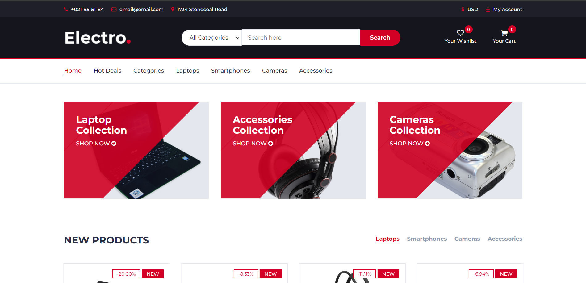

# eCommerce Wesbite - Flask & Stripe


## 
### Description
This is an online eCommerce website to shop for your favourite electronics, using the free bootstrap template by [colorlib](https://themewagon.com/themes/free-bootstrap-ecommerce-template-electro/) and pay using [Stripe](https://stripe.com/) payment solution. 



### Project motivation
I completed this portfolio website, as one of the assignments in professional [Python 100 Days bootcamp](https://www.udemy.com/course/100-days-of-code/) by [Dr. Angela Yu](https://github.com/angelabauer).

### Project steps
In order to tackle this project, I followed the responce from ChatGPT for the following steps:
Creating an eCommerce website using Flask involves several steps. Here's a simplified step-by-step guide:  
   
1. **Set Up Your Development Environment:**  
   - You'll need Python and Flask installed on your development machine.  
   - Install Flask using pip. Open your terminal and run:  
     ```  
     pip install Flask  
     ```  
   
2. **Create a New Flask Application:**  
   - Start by creating a new directory for your project.  
   - In your project directory, create a new file named `app.py` (or whatever you prefer).  
   - In `app.py`, create a simple Flask web server:  
  
     ```python  
     from flask import Flask  
     app = Flask(__name__)  
  
     @app.route("/")  
     def home():  
         return "Hello, Flask!"  
  
     if __name__ == "__main__":  
         app.run(debug=True)  
     ```  
   
3. **Design Your eCommerce Website:**  
   - Create routes for different pages like home, product listing, product detail, cart, checkout, etc.  
   - Use HTML/CSS/JavaScript to design these pages. You may use the Flask's render_template function to render your HTML files.  
   
4. **Implement Database:**  
   - You can use Flask-SQLAlchemy, which is an extension for Flask that adds support for SQLAlchemy to your application.  
   - Install it using pip:  
     ```  
     pip install Flask-SQLAlchemy  
     ```  
   - Use it to create a Product model, Order model, etc.  
   
5. **User Authentication:**  
   - Use Flask-Login or Flask-Security for handling user authentication. These packages help in managing user sessions, securing cookies and more.  
   
6. **Form Handling and Validation:**  
   - Flask-WTF is a popular package that you can use to handle form data and validations.  
   
7. **Handling Payments:**  
   - You can integrate with any popular payment gateway like Stripe, PayPal, etc. Make sure to handle payment data securely.  
   
8. **Deployment:**  
   - Once you are done with development, you can deploy your application. There are several options available including Heroku, AWS, Google Cloud, etc.  

### Quick Start
- Initiate the Products database using `init_db_ecommerce.py`
- Acquire the necessary api keys from Stripe API
- Run main.py after installing the necessary libraries in `requirements.txt`

[//]: # (- Dynamic version at [Render hosted]&#40;https://portfolio-website-d1x4.onrender.com&#41;)
